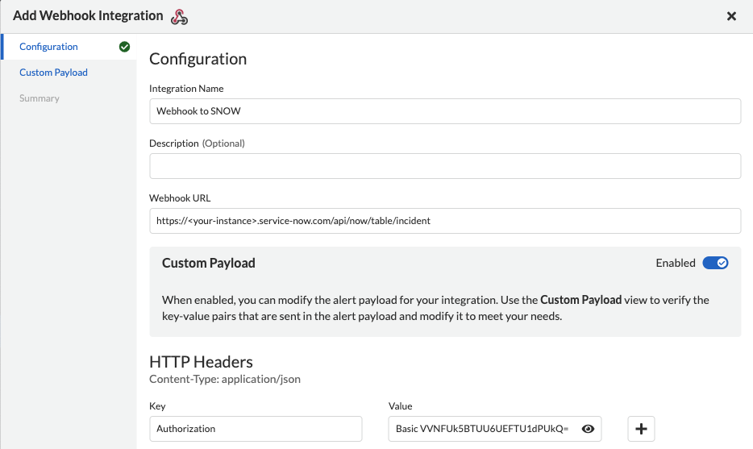
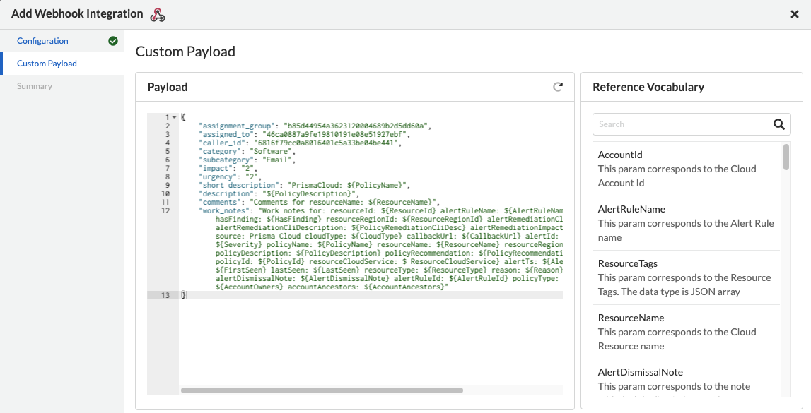
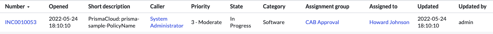
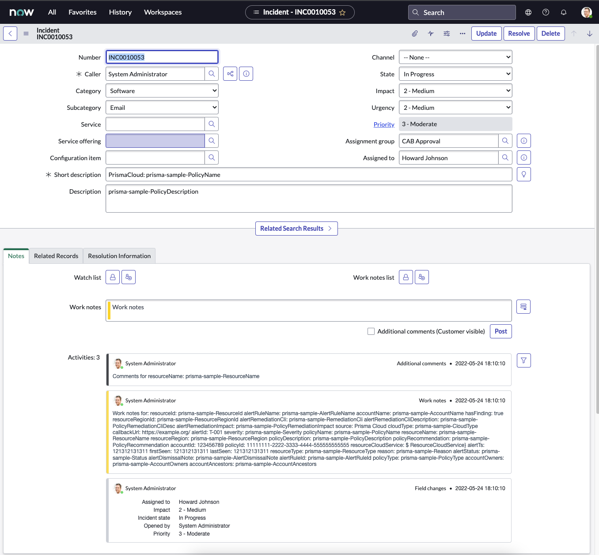

### To create an Incident in SNOW via Webhook (with custom Payload)

#### Prisma Cloud Setup:

1. Create a webhook: _"Settings > Integrations > Add Integration > Webhook"_
    * Tested using the following endpoint: `https://<your-instance>.service-now.com/api/now/table/incident`
    * Enable the _"Custom Payload"_ toggle
    * `base64` encoded username/password for ServiceNow with permission to create an incident table entry
        * You can use online tools to encode, or the following command: 
            
                echo -n "USERNAME:PASSWORD" | base64

        * And decode/verify encoding (ignore the `%`):

                echo "VVNFUk5BTUU6UEFTU1dPUkQ=" | base64 -d

        * Add a new _"HTTP Header"_ and replace the following **ABCD123456** with the `base64` value from above (leaving the `Basic` in the value) 

            | Key | Value |
            | ----------- | ----------- | 
            | Authorization | Basic ABCD123456



2. On the _"Payload"_ screen, replace ALL content with the below. account for your IDs (can be taken from browser URL), categories, required fields, etc as required.
You can also use the reference vocabulary on this screen to see all available variables:
```
{
    "assignment_group": "b85d44954a3623120004689b2d5dd60a",
    "assigned_to": "46ca0887a9fe19810191e08e51927ebf",
    "caller_id": "6816f79cc0a8016401c5a33be04be441",
    "category": "Software",
    "subcategory": "Email",
    "impact": "2",
    "urgency": "2",
    "short_description": "PrismaCloud: ${PolicyName}",
    "description": "${PolicyDescription}",
    "comments": "Comments for resourceName: ${ResourceName}",
    "work_notes": "Work notes for: resourceId: ${ResourceId} alertRuleName: ${AlertRuleName} accountName: ${AccountName} hasFinding: ${HasFinding} resourceRegionId: ${ResourceRegionId} alertRemediationCli: ${RemediationCli}  alertRemediationCliDescription: ${PolicyRemediationCliDesc} alertRemediationImpact: ${PolicyRemediationImpact} source: Prisma Cloud cloudType: ${CloudType} callbackUrl: ${CallbackUrl} alertId: ${AlertId} severity: ${Severity} policyName: ${PolicyName} resourceName: ${ResourceName} resourceRegion: ${ResourceRegion} policyDescription: ${PolicyDescription} policyRecommendation: ${PolicyRecommendation} accountId: ${AccountId} policyId: ${PolicyId} resourceCloudService: $ ResourceCloudService} alertTs: ${AlertTime} firstSeen: ${FirstSeen} lastSeen: ${LastSeen} resourceType: ${ResourceType} reason: ${Reason} alertStatus: ${Status} alertDismissalNote: ${AlertDismissalNote} alertRuleId: ${AlertRuleId} policyType: ${PolicyType} accountOwners: ${AccountOwners} accountAncestors: ${AccountAncestors}"
}
```



You should now see a corresponding SNOW INC created:

And:
