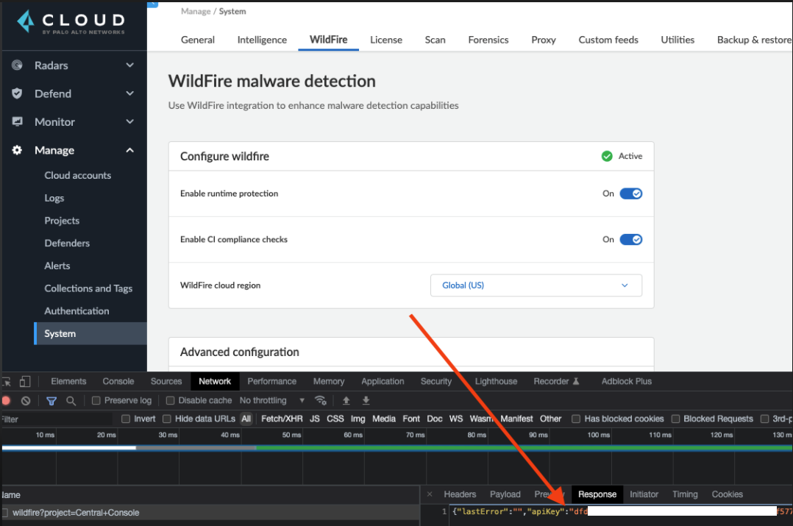

## To test Defender to WildFire communication

To get Compute WildFire api key go to Console and Manage > System then open browser devtools, network tab, then click WildFire and view **wildfire** response for apiKey:


#### Get test file:
```
wget wildfire.paloaltonetworks.com/publicapi/test/elf
```

#### Submit a test file or URL::
```
curl --location --request POST 'https://wildfire.paloaltonetworks.com/publicapi/submit/file' \
--form 'apikey="KEY_HERE"' \
--form 'file=@"/SOME/FILEPATH/SOMEFILE.pdf"'
```

Submission returns the hash values and other info about the file:
```
<?xml version="1.0" encoding="UTF-8"?>
<wildfire>
    <upload-file-info>
        <url></url>
        <filetype>ELF</filetype>
        <filename>elf</filename>
        <sha256>237231fe05a05a4f91e280835b991fdf23acd8b3ed790c7bcdd41762c9e188aa</sha256>
        <md5>a57c3dc086eba546b1d208dedca026b0</md5>
        <size>8608</size>
    </upload-file-info>
</wildfire>
```

#### Get a verdict of file/url:
```
curl --location --request POST 'https://wildfire.paloaltonetworks.com/publicapi/get/verdict' \
--form 'apikey="KEY_HERE"' \
--form 'hash="MD5_OR_SHA256_VALUE"'
```

As long as you received the following back, check the `verdict`:
```
<?xml version="1.0" encoding="UTF-8"?>
<wildfire>
        <get-verdict-info>
                <sha256>237231fe05a05a4f91e280835b991fdf23acd8b3ed790c7bcdd41762c9e188aa</sha256>
                <verdict>1</verdict>
                <md5>a57c3dc086eba546b1d208dedca026b0</md5>
        </get-verdict-info>
</wildfire>
```

The `verdict` element value can be one of the following:
| Status code | Meaning |
| ----------- | ----------- | 
| 0: | benign |
| 1:  | malware
| 2: | grayware
| 4: | phishing
| 5: | C2
| -100: | pending, the sample exists, but there is currently no verdict (applicable to file analysis only)
| -101: | error
| -102: | unknown, cannot find sample record in the database
| -103: | invalid hash value
| HTTP 421| When sending an invalid hash value, an HTTP 421 status is returned.

#### Troubleshooting

Error status codes below:
| HTTP Status code | Meaning |
| ----------- | ----------- | 
| 200 OK | Successful call.
| 401 Invalid API key | Invalid API key. Ensure that the API is correct. Read more about [WildFire API Access Control](https://docs.paloaltonetworks.com/content/techdocs/en_US/wildfire/u-v/wildfire-api/about-the-wildfire-api/wildfire-api-access-control.html#ida6454901-e274-4381-8f64-958d2404e6e3).
| 403 Forbidden | Permission Denied.
| 404 Not Found| The sample or report was not found.
| 405 Unsupported Method | Invalid request method. Ensure you are using POST for all calls except for /test/pe.
| 413 Request Entity Too Large | Sample file size over maximum limit.
| 418 Unsupported File Type | Sample file type is not supported.
| 419 Max Request Reached | The maximum number of uploads per day has been exceeded. If you continue to make API requests, you will receive this error until the daily limit resets at 23:59:00 UTC. Read more about [WildFire API Access Control](https://docs.paloaltonetworks.com/content/techdocs/en_US/wildfire/u-v/wildfire-api/about-the-wildfire-api/wildfire-api-access-control.html#ida6454901-e274-4381-8f64-958d2404e6e3).
| 420 Insufficient Arguments | Insufficient arguments. Ensure the request has the required request parameters.
| 421 Invalid Argument | Invalid arguments. Ensure the request is properly constructed.
| 422 Unprocessable Entities | The provided file or URL cannot be processed. Possible reasons include:<br /> * The specified URL cannot be downloaded.<br /> * The specified file has formatting errors or invalid content.
| 500 Internal Error | Internal error.
| 513 | File upload failed.


#### Refs:

https://docs.paloaltonetworks.com/wildfire/9-1/wildfire-admin/submit-files-for-wildfire-analysis/verify-wildfire-submissions/test-a-sample-malware-file

https://docs.paloaltonetworks.com/wildfire/u-v/wildfire-api/get-wildfire-information-through-the-wildfire-api/get-a-wildfire-verdict-wildfire-api

https://docs.paloaltonetworks.com/wildfire/u-v/wildfire-api/get-wildfire-information-through-the-wildfire-api/wildfire-api-error-codes
